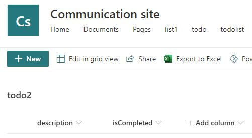
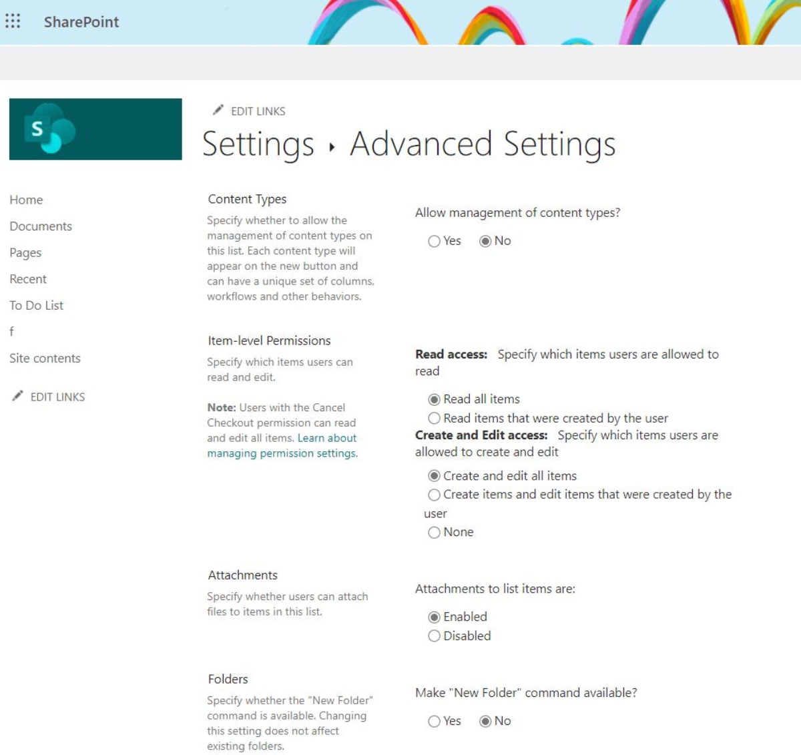
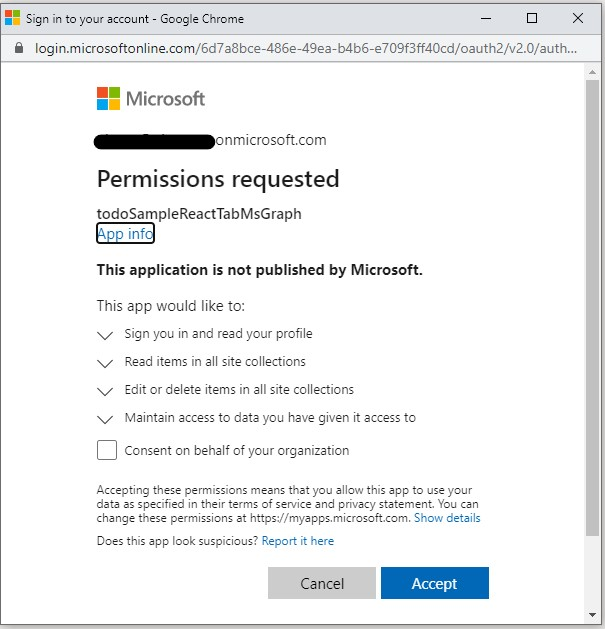

# Getting Started with Todo Sample - React Tab and MS Graph

## TeamsFx basic sample for Tab app:

### This sample app is a personal tab used to manage To-do List.

- The frontend is a react tab hosting on [Azure Storage](https://docs.microsoft.com/en-us/azure/storage/).
- The data is stored at [SharePoint List](https://support.microsoft.com/en-us/office/introduction-to-lists-0a1c3ace-def0-44af-b225-cfa8d92c52d7).

### What you will learn in this sample:
- How to use TeamsFx to build frontend hosting on Azure for your tab app.
- How to use Microsoft Graph client in TeamsFx SDK to get access to M365 data.
- How to use TeamsFx simple auth capability to get Teams user login information.

### Set up SharePoint List
1. [Join the Microsoft 365 Developer Program](https://docs.microsoft.com/en-us/office/developer-program/microsoft-365-developer-program) to get a M365 test account.
1. Create a new site or use an existing site in SharePoint.
1. Create a SharePoint list.
1. Add 'description' column (type: 'Single line of text') in the list.
1. Add 'isCompleted' column (type: 'Yes/No') in the list, and set default value to 'No'.

    

6. [Optional] If you want your users to only see the items created by themselves.
    - In List Page, click `setting` button and then choose `list setting`.
    
        
    
    - In `Advanced Settings`, set the `Read Access` to `Read items that were created by the user`, and set the `Create and Edit access` to `Create items and edit items that were created by the user`.
    
        

### Running this Sample App:
1. Clone the repo to your local workspace or directly download the source code.
1. Download [Visual Studio Code](https://code.visualstudio.com) and install [TeamsFx Toolkit](https://mods-landingpage-web.azurewebsites.net/md/install/index.md).
1. Open the project in Visual Studio Code.
1. [Optional] Navigate to the [answers.json](.mods/answers.json) file under `.mods` folder, change the app-name as what you want. It will be the name of your Teams app.
1. Open Command Palette (Ctrl+Shift+P), type `TeamsFx - Provision Resource` in VS Code and choose the subscription to provision the environment required to run the app. Notice that this step will provision Azure resources under your Azure subscription and will cause charges. After provision, you can navigate to the [env.default.json](.mods/env.default.json) file to check the environment information for your app.

1. Navigate to the [StorageClient.js](tabs/src/components/StorageClient.js) file, set the value for `siteId` and `listId` on line 4 and 5.
    * For `listId`, you could use the list name.
    * For `siteId`, log in and then edit your URL to look like `https://<yourdomain>.sharepoint.com/sites/<yoursite>/_api/site/id` in browser to see your site id. Refer to [this](https://www.sharepointdiary.com/2018/04/sharepoint-online-powershell-to-get-site-collection-web-id.html) for more infomation. If you are using root site, you just could use 'root' as site id. Attention: subsite is not supported currently.

        

1. Navigate to the [Tab.js](tabs/src/components/Tab.js) file, set the `clientId` on line 53 to value in [env.default.json](.mods/env.default.json) file.
    * For local debug, you can use the `local_clientId`  in `mods-toolkit-plugin-aad-app-for-teams`. (Generated until your first local debug)
    * For remote debug, you can use the `clientId` in `mods-toolkit-plugin-aad-app-for-teams`.

1. Open Command Palette (Ctrl+Shift+P) and type `TeamsFx - Deploy Package` in VS Code and select "Tab" to build and deploy your tab app.

1. Press "F5" to open a Chrome window and then select your package to view todo list manager sample app.
    * For remote debug, you can choose the profile "Launch Remote (Edge)" or "Launch Remote(Chrome)" and press "F5".

1. If you met the error that app cannot be added. You can go to [Teams admin center](https://admin.teams.microsoft.com/policies/app-setup/) and setup a new policy that enables "Upload custom apps".

    

### How to use this Sample App:
1. The app should be running like this, and you could click the start button:

    

2. For the first time to run the app, you need to consent the app to get your profile information and manage SharePoint site. Click on "Accept" button to accept the Authorization.

    

3. You could try to add new todo item by typing item and click "Add" button.
4. You could try to complete todo item by choosing the checkbox before the item.
5. You could try to update todo item by typing text in todo item list.
6. You could try to delete todo item by clicking "..." and then choose "delete" button.

    

### Code structure:

- You can check app configuration in: [answers.json](.mods/answers.json)
- You can check the environment information in [env.default.json](.mods/env.default.json)
- You will find frontend code in: [tabs](tabs)
